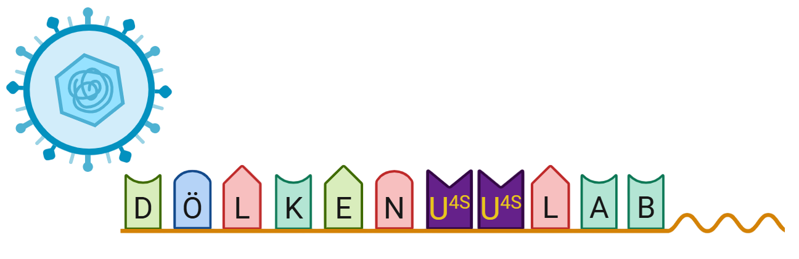
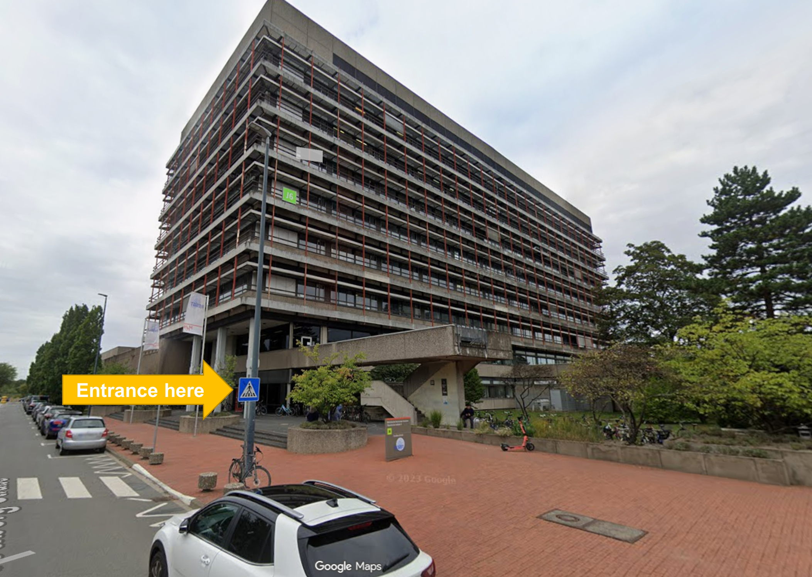
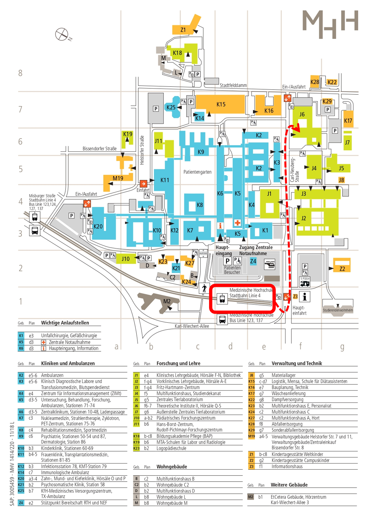

We are located in building J6 of [Hannover Medical School (MHH)](https://www.mhh.de/en/) at the [Institute of Virology](https://www.mhh.de/en/mhh-institutes/virology), Dölken Group [(AG Dölken)](https://www.mhh.de/virologie/forschung/doelken-lab).

## Join us

If you are interested in joining the group for a Master’s thesis, MD project, PhD position, or postdoctoral research, feel free to get in touch by [email](mailto:agdoelken@gmail.com?subject=Application). Please include a short description of your background and your research interests.

## Contact

:::::: columns
::: {.column width="45%"}
## Lab Space

[OE5230 Institute of Virology](https://www.mhh.de/en/mhh-institutes/virology)   [Hannover Medical School (MHH)](https://www.mhh.de/en/)   Phone: [0741 235 115 94+]{.obfuscate-tel}   Carl-Neuberg-Str. 1   30625, Hannover   Germany  

[Find J6 on Google Maps](https://maps.google.com){.btn .btn-success}
:::

::: {.column width="10%"}
:::

::: {.column width="45%"}
## Director

Prof. Dr. med. Lars Dölken   Director of the Institute of Virology   [Email Lars](mailto:doelken.lars@mh-hannover.de?subject=Contact%20from%20Doelken%20Group%20Website){.btn .btn-orange .btn-sm role="button"}   Secretary Phone: [6376 235 115 94+]{.obfuscate-tel}

:::

<iframe src="https://www.google.com/maps/embed?pb=!1m18!1m12!1m3!1d4870.482501454316!2d9.797860477114384!3d52.384176772025825!2m3!1f0!2f0!3f0!3m2!1i1024!2i768!4f13.1!3m3!1m2!1s0x47b00c82e6900db1%3A0x9bb409fadabb31ef!2sJ6%20-%20Theoretische%20Institute%20II%2C%20H%C3%B6rs%C3%A4le%20Q-S%20(MHH)!5e0!3m2!1sen!2sde!4v1769091946847!5m2!1sen!2sde" width="600" height="450" st yle="border:0;" allowfullscreen loading="lazy" referrerpolicy="no-referrer-when-downgrade">

</iframe>
::::::

### Arriving by Public Transport

The MHH campus is easily reached via tram (line 4, direction Roderbruch) from the city centre (Kröpcke), which is a five minute walk from Hannover main station (Hauptbahnhof, Hbf). You can also take the S-Bahn to the "Bahnhof Karl-Wiechert-Allee" station and switch to the U-Bahn line 4 from there. Depending on your location you may also take the Bus (#123, #124, #137). Both "Misburger Straße" and "Medizinische Hochschule" stations are close by (See plan below).

### Arriving by Bike & Car

Parking for both cars and bikes is available throughout the campus area.

All original content on this site is licensed under CC BY 4.0.

© 2026 AG Dölken[.](secret.qmd){.secret-link}
