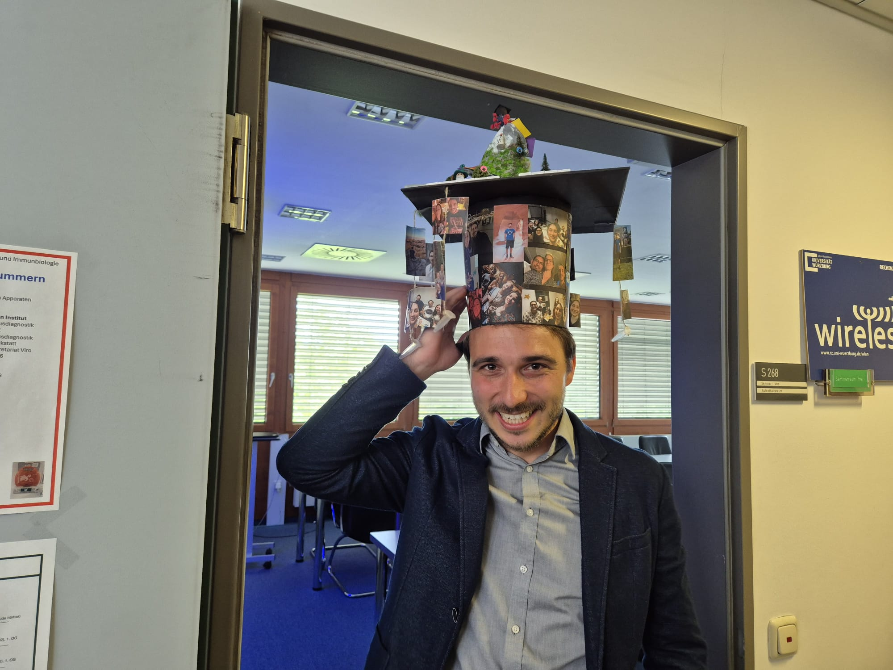
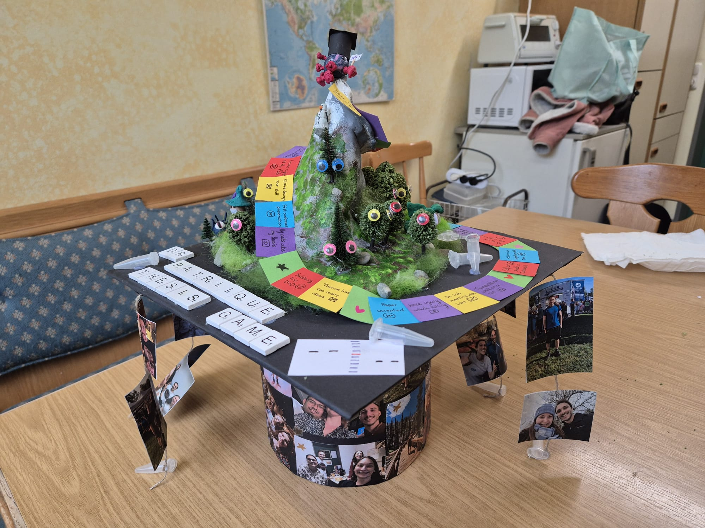

::: {#ph-patrick_defence layout-ncol=2}

Patrick's thesis defence, May 2026
:::

We are delighted to share that Patrick Fischer successfully defended 
his doctoral thesis on May 19th, 2026, at the University of Würzburg. 
His thesis, entitled *Modulation of the DNA Damage Response and 
Interferon Pathways by the HSV-1 UL36DUB and the DTX3L–PARP9 Complex*, 
was defended in a hybrid format at Room S268, Institute for Virology 
and Immunobiology in Würzburg.

Patrick's doctoral project was carried out as part of 
[DEEP-DV (FOR 5200)](https://deep-dv.org/wp/p02-lars-doelken-2/) — 
*Disrupt, Evade, Exploit* — a DFG-funded research unit investigating 
how herpesviruses manipulate their hosts. His work, carried out in 
close collaboration with our lab manager and postdoctoral researcher 
Thomas Hennig, represents a significant contribution to our 
understanding of how HSV-1 modulates key host defense pathways, 
specifically the DNA damage response and interferon-stimulated gene 
expression via the DTX3L–PARP9 complex.

We are incredibly proud of Patrick's achievement and wish him all 
the best in the next chapter of his career.

Congratulations, Dr. Fischer! 🎉

<!--Leave this part as is-->
[← Return to News Overview](../news.qmd){.btn .btn-orange .btn-sm role="button"}
[← Return to Homepage](../index.qmd){.btn .btn-orange .btn-sm role="button"}