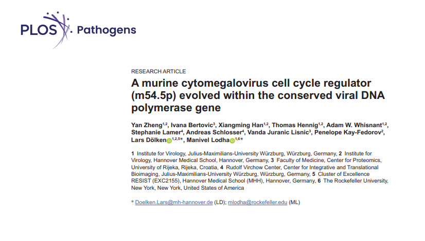

 

We are thrilled to share that Yan Zheng's paper has been published in *PLOS Pathogens*! The study, entitled *A murine cytomegalovirus cell cycle regulator (m54.5p) evolved within the conserved viral DNA polymerase gene*, is the result of four years of collaborative work across multiple institutions, including the Dölken Lab at Hannover Medical School (MHH) and the University of Würzburg, the [Center for Proteomics at the University of Rijeka](https://medri.uniri.hr/), and [The Rockefeller University](https://www.rockefeller.edu/).

The study reports the discovery and characterization of **m54.5p**, a previously unknown murine cytomegalovirus (MCMV) protein hidden entirely within the viral DNA polymerase gene (*M54*) — one of the most highly conserved regions across all herpesviruses. Originally identified through ribosome profiling (Ribo-seq) and transcription start site profiling as part of a comprehensive MCMV genome reannotation, m54.5p had gone undetected by conventional in-silico gene prediction due to its 100% overlap with the *M54* coding sequence. The project was carried out in close collaboration with **Manivel Lodha**, a former Dölken Lab PhD student now working as a postdoctoral researcher at The Rockefeller University, alongside partners at the University of Rijeka.

Yan and her collaborators show that m54.5p is a nuclear viral early protein that interacts with two key host cell complexes: the anaphase-promoting complex/cyclosome (APC/C) and protein phosphatase 6 (PP6). By recruiting PP6 into the nucleus and inducing a catalytically inactive APC/C, m54.5p drives the nuclear accumulation of canonical APC/C substrates — including geminin, securin, and Cyclin A — ultimately promoting G1 cell cycle arrest. This mechanism bears a striking resemblance to, yet is mechanistically distinct from, the HCMV UL21a protein, which achieves a similar outcome by degrading APC/C subunits outright — a compelling example of convergent evolution between two cytomegaloviruses.

While an m54.5p-null mutant virus replicated normally in cell culture, it was significantly attenuated in the lungs of mice by 14 days post-infection, highlighting the *in vivo* importance of this novel regulator.

The findings underscore the remarkable plasticity of herpesvirus genomes: even within one of their most conserved genomic regions, cytomegaloviruses can evolve entirely new regulatory proteins. The work was supported by the Deutsche Forschungsgemeinschaft (DFG FOR 2830) and involved key contributions from Thomas Hennig, Adam Whisnant, and PI Prof. Dr. Lars Dölken, alongside collaborators at Rijeka and The Rockefeller University.

Congratulations, Yan — and to all co-authors! 🎉

**Full citation:** Zheng Y, Bertovic I, Han X, Hennig T, Whisnant AW, Lamer S, et al. (2026) A murine cytomegalovirus cell cycle regulator (m54.5p) evolved within the conserved viral DNA polymerase gene. *PLoS Pathog* 22(5): e1013424. [https://doi.org/10.1371/journal.ppat.1013424](https://doi.org/10.1371/journal.ppat.1013424)

<!--Leave this part as is-->
[← Return to News Overview](../news.qmd){.btn .btn-orange .btn-sm role="button"}
[← Return to Homepage](../index.qmd){.btn .btn-orange .btn-sm role="button"}