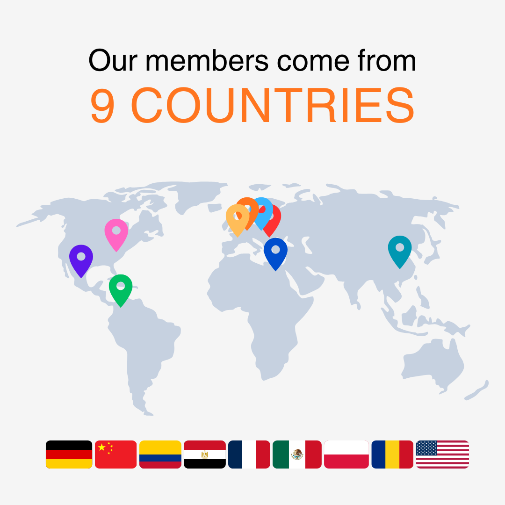

```{r setup_function}
#| echo: false
#| message: false

library(yaml)

generate_team_grid <- function(status_filter) {
  people <- yaml::read_yaml("people.yml")
  img_path <- "img/people"
  placeholder <- "placeholder.jpg"

  selected_people <- Filter(function(x) {
    person_status <- if (is.null(x$status)) "current" else x$status
    person_status == status_filter
  }, people)

  cat('<div class="team-grid">')

  for (person in selected_people) {
    full_img_url <- file.path(img_path, person$img)
    if (!file.exists(full_img_url)) {
      full_img_url <- file.path(img_path, placeholder)
    }

    has_url <- !is.null(person$url) && nzchar(person$url)
    has_email <- !is.null(person$email) && nzchar(person$email)

    # label for email button
    first_name <- if (!is.null(person$email_label) && nzchar(person$email_label)) {
      person$email_label
    } else if (!is.null(person$name) && nzchar(person$name)) {
      strsplit(person$name, "\\s+")[[1]][1]
    } else {
      "E-mail"
    }

    # Name as link if profile URL exists (NO wrapping whole card)
    name_html <- if (has_url) {
      paste0('<a href="', person$url, '" class="team-name-link">', person$name, '</a>')
    } else {
      person$name
    }

    # Optional email button (safe now, not nested)
    email_btn <- ""
    if (has_email) {
      email_btn <- paste0(
        '<a class="team-email-btn" href="mailto:', person$email, '">',
        '✉️ E-mail ', first_name,
        '</a>'
      )
    }

    html_out <- paste0(
      '<div class="team-card">',
      '',
      '<div class="team-text">',
      '<strong>', name_html, '</strong>',
      '<div>', person$role, '</div>',
      email_btn,
      '</div>',
      '</div>'
    )

    cat(html_out)
  }

  cat('</div>\n\n')
}


```

## Current members

```{r display_current_members}
#| echo: false
#| message: false
#| results: asis

generate_team_grid("current")
```

## Alumni and Past members

The lab has benefited from the dedication and creativity of many students and researchers over the years. We are proud of their accomplishments and grateful for their lasting impact on the group.

```{r display_alumni}
#| echo: false
#| message: false
#| results: asis

generate_team_grid("alumni")
```
